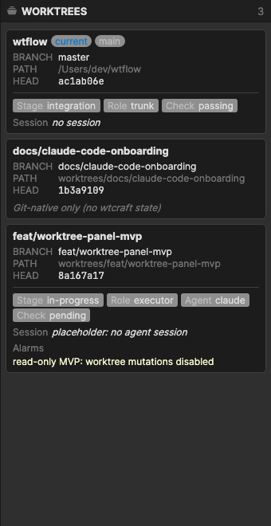

# wtflow - Git GUI for Worktrees & AI Agents

`wtflow` is a powerful, cross-platform Git GUI client engineered specifically for **Git Worktrees** and **AI Agent Workflows**. 

It is a hard fork of the excellent [SourceGit](https://github.com/sourcegit-scm/sourcegit) project, deeply modified to treat worktrees as first-class citizens and seamlessly integrate with the `wtcraft` machine protocol.

## Screenshots

* **The Worktree Panel** - Manage your concurrent tasks and agent contracts effortlessly.
  
  

## Why wtflow?

While traditional Git GUIs focus heavily on branch management within a single working directory, modern development often involves multiple simultaneous tasks and AI agents operating concurrently. 

**wtflow brings:**
* **First-Class Worktree Support**: A dedicated panel to visualize, create, and switch between Git worktrees seamlessly.
* **Agent Harness Visibility**: Native visualization of `.worktree-task.md` contracts. The stage, agent role, and verification status displayed here are directly integrated with our sibling project **[`wtcraft`](https://github.com/zywkloo/wtcraft)**.
* **`wtcraft` Protocol Integration**: Interacts with the `wtcraft` CLI via its machine-readable JSON protocol to ensure the GUI perfectly mirrors the CLI state.
* **Fast & Native**: Built with Avalonia UI for incredible performance across macOS, Windows, and Linux.

## Highlights
*(Inherited and enhanced from SourceGit)*
* Supports Windows / macOS / Linux
* Blazing Fast
* Visual commit graph
* Built-in light/dark themes
* Supports SSH access with each remote
* Comprehensive Git commands (Merge/Rebase/Reset/Revert/Cherry-pick...)
* Interactive rebase
* Built-in conventional commit message helper

## Development & Setup

Make sure you have .NET 10 SDK installed.

### Quick Start
```bash
# 1. Initialize submodules and restore NuGets
make setup

# 2. Build and launch the app
make run
```

## Acknowledgments & Credits

`wtflow` is built upon the phenomenal foundation of **[SourceGit](https://github.com/sourcegit-scm/sourcegit)** created by the SourceGit community. 

We deeply appreciate their hard work, robust architecture, and open-source spirit. Without SourceGit, `wtflow` would not exist.

Thanks to all the people who contributed to the original project:

[](https://github.com/sourcegit-scm/sourcegit/graphs/contributors)

For detailed license information of third-party components, see [THIRD-PARTY-LICENSES.md](THIRD-PARTY-LICENSES.md).
